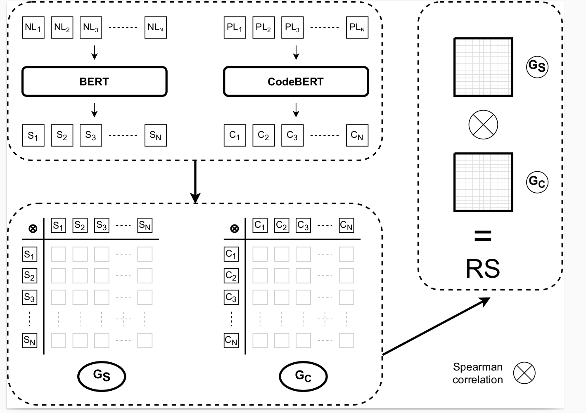
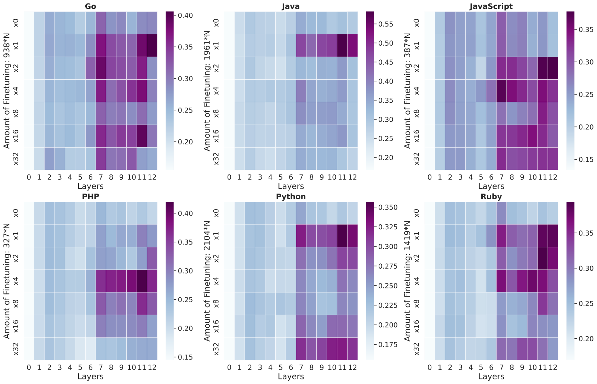
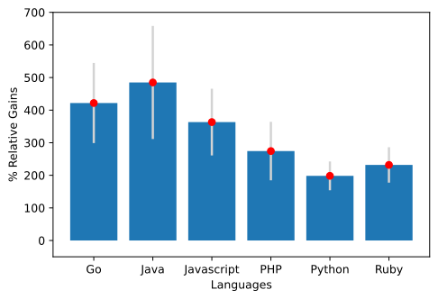
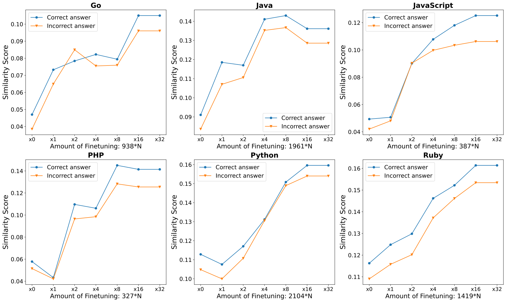

# Motivation
We want to unbox the black box. Language Models of Code are prominent today. They can write your code for you and thus it is imperative we study how much do they actually understand when they are giving their outputs. We use the problem description as our Natural language input to BERT. We use the docstring for Natural language input for the CodeBERT and the associated code as the Code input. 

Arxiv Link : `https://arxiv.org/abs/2207.07706?context=cs`

# Abstract 
Representational Similarity Analysis is a method from cognitive neuroscience, which helps in comparing representations from two
different sources of data. In this paper, we propose using Representational Similarity Analysis to probe the semantic grounding in language
models of code. We probe representations from the CodeBERT model for
semantic grounding by using the data from the IBM CodeNet dataset.
Through our experiments, we show that current pre-training methods
do not induce semantic grounding in language models of code, and instead focus on optimizing form-based patterns. We also show that even
a little amount of fine-tuning on semantically relevant tasks increases
the semantic grounding in CodeBERT significantly

# RSA
Given $N$ natural language description - code snippet pairs (NL-PL): we first obtain the code representations $\{C_k\}$ from the code snippets with CodeBERT. Similarly, we obtain the semantic representations $\{S_k\}$ from the natural language descriptions with BERT, where $k \epsilon [1,N]$. For ablation purposes, we extract code representations under two different input settings: Unimodal (PL-only) and Bimodal (NL and PL) as supported by the CodeBERT model. Next, we construct the individual representational geometries ($\mathcal{G} \in \mathbb{R}^{N \times N}$) for $\{C_k\}$ and $\{S_k\}$ by computing the pairwise dissimilarities between all the samples in the dataset:

 

  

We say that higher the score, higher the semantic grounding. 

# Localization of Semantic grounding

 

  

Finetuning here meant further training the network on select examples. More details in the Dataset section of paper.

# Bimodal vs Unimodal 
We show that Natural language input plays a key part in boosting the semantic grounding.   
Thus we suggest to add a small docstring to your code for better downstream performance.

 

  

# Correct vs Incorrect 

We see that CodeBERT can detect difference between correct and incorrect code. But we also see that finetuning, increases semantic grounding for incorrect examples as well. We think that this suggests that the meaning of the code is not the primary objective of the finetuning, but its the form of the code. For details see Figure 9 in the paper. 

 

  
